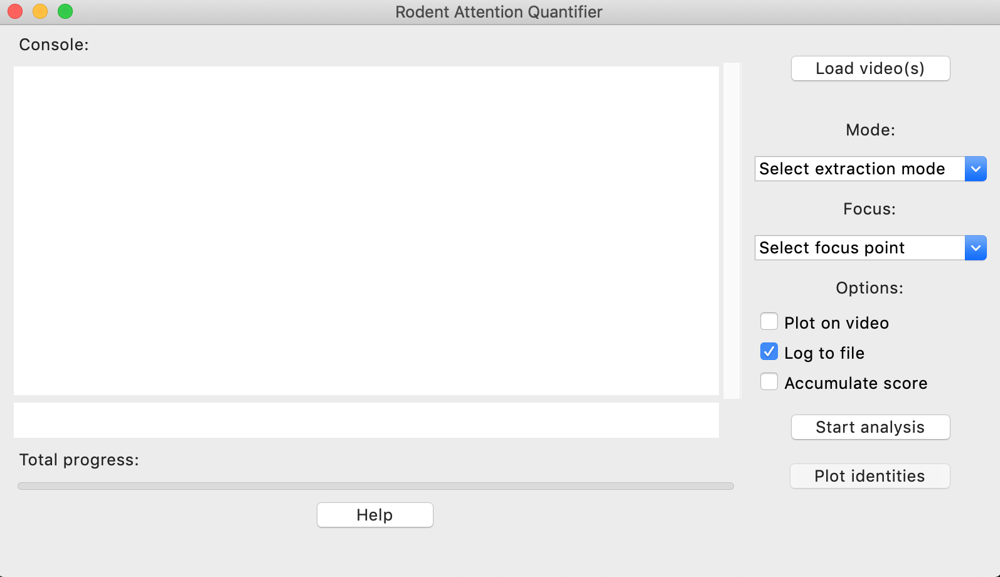

# Rodent Attention Quantifier (RAQ)

RAQ is a tool written by me for a neuroscience research institute at NTNU in Trondheim, Norway.

The tool simplifies and automates attention quantification of two rats used in a behavioral study. The tool can process one or more videos and uses head angles towards a subject as a proxy for attention. The analysis is operated trough an intuitive GUI, and allows the user to quickly analyse the experiment sessions with minimal user input and outputs an attention score. 

All video manipulation is done trough OpenCV, GUI is made with Tkinter and the data is structured with Pandas. The pose tracking of the rodents are done trough DeepLabCut and utilizes a pre trained model for inference (not included in the public version). 

# Preview

## Depentencies:

See RAQ-CPU.yaml (for cpu) or RAQ-GPU.yaml (for gpu)

## Open code documentation:

open docs/index.html

## Installation for CPU only:

* Install miniconda 64-bit version
* Change directory to project root
* conda env create -f RAQ-CPU.yaml

## Installation for GPU (requires CUDA compatible GPU):

* Install miniconda 64-bit version
* Change directory to project root
* conda env create -f RAQ-GPU.yaml

## Run program:

conda activate RAQ-CPU or RAQ-GPU

for windows:
ipython GUI.py

for mac:
pythonw GUI.py

## Pipeline:
* Select video(s) to process ->
* Select analysis options ->
* Start analysis ->
* crop (GUI) ->
* confine observer (GUI)
* frames with light will be extracted as well as normalized, grayscale filtered and compressed ->
* analysis of video with multi animal deeplabcut (beta) ->
* create tracklets (points) ->
* read trackelts ->
* fix identities ->
* calculate angle from chose point to chosen point ->
* plot angles and vectors used to calculate angles on top of video ->
* pipeline done!
